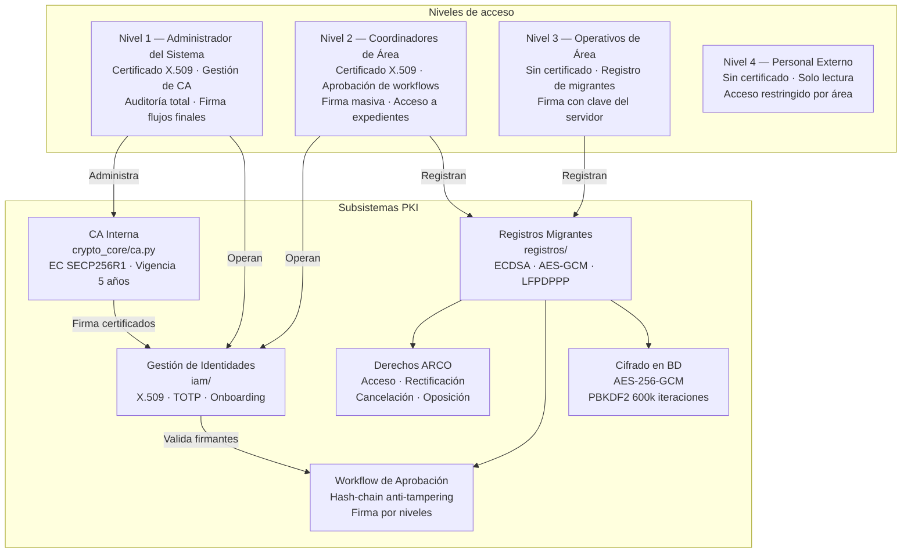

<div align="center">

# 🦋 Casa Monarca — Sistema de Criptografía e Identidades Digitales

**Plataforma PKI para gestión segura de identidades y documentos en organizaciones de apoyo migrante**

[](https://python.org)
[](LICENSE)
[](CHANGELOG.md)

> **MA2006B** — Uso de Álgebras Modernas para Seguridad y Criptografía  
> Tecnológico de Monterrey · Equipo 1 · Grupo 602 · 2026

</div>

---

## Contexto

[Casa Monarca](https://www.casamonarca.org.mx/) es una organización sin fines de lucro que brinda apoyo humanitario a personas migrantes en Monterrey, México. En el ejercicio de sus operaciones, la organización maneja información altamente sensible: datos personales, documentos de identidad, registros de atención y expedientes de casos.

Este proyecto forma parte del reto integrador de la materia **MA2006B** del Tecnológico de Monterrey, cuyo objetivo es diseñar e implementar una solución criptográfica real para un socio formador con impacto social.

---

## El problema

El manejo no controlado de información sensible de migrantes expone a la organización y a las personas atendidas a riesgos graves:

- **Falsificación y alteración de documentos** — registros modificados sin trazabilidad
- **Suplantación de identidad** — un impostor se hace pasar por colaborador autorizado
- **Acceso no autorizado** — exfiltración de datos personales (PII) de población vulnerable
- **Incumplimiento legal** — violación a la LFPDPPP (Ley Federal de Protección de Datos Personales)
- **Falta de no-repudio** — imposibilidad de probar quién autorizó una acción crítica

---

## La solución

Sistema basado en **Infraestructura de Clave Pública (PKI)** que implementa los seis subsistemas requeridos por el reto MA2006B:

### (a) Sistema de Gestión de Identidades

Ciclo de vida completo de certificados X.509 firmados por una CA interna:

- Emisión, suspensión, reactivación, revocación y baja de certificados
- Cuatro niveles de acceso con permisos diferenciados
- Proceso de onboarding con aprobación multinivel y verificación de identidad
- Auditoría criptográfica de todas las acciones de identidad (`CertificateAuditLog`)

### (b) Sistema de Gestión de Documentos

Integridad, autenticidad, confidencialidad y no-repudio de registros migrantes:

- Firma digital ECDSA secp256k1 de cada registro en el momento de su creación
- Cifrado AES-256-GCM de todos los campos PII en la base de datos
- Hash-chain SHA-256 anti-tampering sobre todas las acciones del sistema
- Verificación de autenticidad en cualquier momento desde el expediente

### (c) Sistema de Firma de Correos Electrónicos

Firma y verificación inspirada en PGP para comunicaciones de la organización:

- Firma de contenido de correos y adjuntos con clave privada EC/RSA
- Verificación de integridad y autenticidad por el receptor
- No-repudio: el firmante no puede negar haber enviado el mensaje
- Disponible en el SDK (`sdk/email_sign.py`)

### (d) Sistema de Gestión de Formularios con Firma

Formularios firmados análogos a la e.firma del SAT mexicano:

- Consentimiento informado firmado digitalmente por el operador
- Solicitudes ARCO con flujo de autorización multinivel firmado
- Generación de PDF de respuesta con firma digital del autorizador
- Workflow: `submitted → pending_review → escalated → approved → executed`

### (e) Sistema de Verificación Externa de Documentos

Verificación de documentos por terceros sin acceso al sistema interno:

- Panel de verificación público (sin autenticación requerida)
- Verificación de certificados X.509 contra la CA interna
- Verificación de firmas ECDSA de registros migrantes
- API pública de solo lectura para agentes externos

### (f) Sistema de Gestión de Llaves de Base de Datos

Protección de claves secretas con criptografía de clave pública:

- Clave maestra AES-256 derivada con PBKDF2-HMAC-SHA256 (600,000 iteraciones, OWASP 2023)
- Clave privada de la CA cifrada en reposo con AES-GCM + contraseña maestra del admin
- Campos PII cifrados de forma transparente mediante `EncryptedTextField` / `EncryptedDateField`
- La clave maestra nunca se guarda en texto plano — solo existe en memoria durante la sesión

---

## Arquitectura del sistema



---

## Inicio rápido

### Requisitos previos

- Python 3.11+
- pip
- (Opcional) MySQL 8.0+ para producción

### 1. Clonar y crear entorno virtual

```bash
git clone https://github.com/brbrbre/Casa-Monarca-Criptografia.git
cd Casa-Monarca-Criptografia/CriptoReto

python3 -m venv .venv
source .venv/bin/activate        # macOS / Linux
# .venv\Scripts\Activate.ps1    # Windows PowerShell
```

### 2. Instalar dependencias

```bash
pip install -r requirements.txt
```

### 3. Variables de entorno

Crea `.env` en `CriptoReto/` a partir de `.env.example`:

```env
# Clave maestra de la CA interna
CA_MASTER_PASSWORD=tu_password_seguro_de_ca

# Cifrado de campos PII en base de datos
DB_ENCRYPTION_MASTER_PASSWORD=otro_password_seguro
DB_ENCRYPTION_SALT=<hex de 32 chars, p.ej. python -c "import secrets; print(secrets.token_hex(16))">

# JWT de sesión (opcional)
JWT_SECRET_KEY=clave_jwt_segura

# MySQL (opcional — por defecto usa SQLite)
MYSQL_DATABASE=casamonarca
MYSQL_USER=casamonarca_user
MYSQL_PASSWORD=...
MYSQL_HOST=127.0.0.1
MYSQL_PORT=3306
```

### 4. Migraciones y datos de prueba

```bash
python manage.py migrate
python manage.py shell < seed.py
```

### 5. Iniciar servidor

```bash
python manage.py runserver
```

Abre [http://127.0.0.1:8000](http://127.0.0.1:8000) en tu navegador.

### Demo PKI (línea de comandos)

```bash
bash Demo.sh
```

Demuestra el flujo completo desde cero: generación de certificado → firma de documento → verificación.  
Requiere: `openssl` (incluido en macOS/Linux).

---

## Estructura del repositorio

```
Casa-Monarca-Criptografia/
├── CriptoReto/                  # Aplicación principal Django
│   ├── casamonarca/             # Configuración de proyecto (settings, urls, wsgi)
│   ├── crypto_core/             # Módulo criptográfico central (sin dependencias Django)
│   │   ├── ca.py                # Autoridad Certificadora interna (EC SECP256R1 + AES-GCM)
│   │   ├── certificates.py      # Emisión y verificación de certificados X.509 (RSA-2048)
│   │   ├── signatures.py        # Firma de flujos finales (RSA-PSS + X.509)
│   │   ├── encryption.py        # AES-256-GCM para cifrado de campos en BD
│   │   ├── fields.py            # EncryptedTextField / EncryptedDateField (Django ORM)
│   │   ├── hashing.py           # SHA-256, hash-chain, snapshot de BD
│   │   └── auth_tokens.py       # JWT de sesión (PyJWT)
│   ├── iam/                     # Gestión de identidades y acceso (subsistema a)
│   │   ├── models.py            # Collaborator, UserCertificate, AuditLog
│   │   ├── views.py             # Login, onboarding, certificados, auditoría
│   │   └── certificates.py      # Capa de servicio de certificados
│   ├── registros/               # Registros migrantes + ARCO + Workflow (subsistemas b, d, e)
│   │   ├── models.py            # MigrantRegistration, ArcoRequest, ArcoTicket, Ticket, ...
│   │   ├── views.py             # CRUD + ARCO + Workflow + firma masiva
│   │   ├── workflow.py          # Lógica de flujos de aprobación
│   │   └── services.py          # sign_registration, verify, batch_sign, sign_final_flow
│   ├── templates/               # HTML Django (CSS vanilla + Font Awesome)
│   └── tests/                   # Suite de pruebas (pytest + pytest-django)
├── sdk/                         # SDK público para integración con sistemas externos
│   ├── __init__.py
│   ├── identity.py              # Ciclo de vida de certificados (subsistema a)
│   ├── documents.py             # Firma y verificación de documentos (subsistema b)
│   ├── email_sign.py            # Firma de correos electrónicos (subsistema c)
│   ├── forms.py                 # Formularios con firma digital (subsistema d)
│   ├── verification.py          # Verificación pública de documentos (subsistema e)
│   ├── key_manager.py           # Gestión de claves secretas (subsistema f)
│   └── README.md                # Guía de uso del SDK
├── Casos de Prueba/             # Evidencias fotográficas de casos de prueba (CP 1-80)
├── Demo.sh                      # Demo PKI de extremo a extremo (CLI)
├── README.md                    # Este archivo
├── TODO.md                      # Tareas pendientes y estado del proyecto
├── CHANGELOG.md                 # Historial de cambios (formato Keep a Changelog)
├── LICENSE                      # MIT — sin uso comercial, atribución requerida
└── .gitignore
```

---

## Tecnologías utilizadas

| Capa | Tecnología |
|---|---|
| Backend | Python 3.11 + Django 5.x |
| Criptografía | `cryptography` — X.509, EC SECP256R1/secp256k1, RSA-PSS, AES-256-GCM, PBKDF2 |
| Autenticación | Django Auth + TOTP (`pyotp`) + JWT (`PyJWT`) |
| CA interna | Generada con `cryptography` (sin dependencia de step-ca en producción) |
| Base de datos | SQLite (desarrollo) · MySQL 8.0 (producción) |
| PDF | ReportLab |
| Frontend | HTML/CSS vanilla + Font Awesome (sin framework JS) |
| Testing | pytest + pytest-django |
| Scripting | Bash + OpenSSL (Demo.sh) |

---

## Propiedades de seguridad por subsistema

| Subsistema | Confidencialidad | Integridad | Autenticidad | No-repudio | Disponibilidad |
|---|:---:|:---:|:---:|:---:|:---:|
| (a) Gestión de Identidades | ✓ | ✓ | ✓ | ✓ | ✓ |
| (b) Gestión de Documentos | ✓ | ✓ | ✓ | ✓ | — |
| (c) Firma de Correos | — | ✓ | ✓ | ✓ | — |
| (d) Formularios con Firma | — | ✓ | ✓ | ✓ | ✓ |
| (e) Verificación Externa | — | ✓ | ✓ | — | ✓ |
| (f) Gestión de Llaves BD | ✓ | ✓ | ✓ | — | — |

---

## Usuarios de prueba

| Usuario | Contraseña | Nivel | Rol |
|---|---|---|---|
| `mariel_alvarez` | `Mariel2026!` | 1 — Administrador | Administración total |
| `emiliano_ruiz` | `Emiliano2026!` | 2 — Coordinador | Área Legal |
| `brisma_alvarez` | `Brisma2026!` | 3 — Operativo | Área Humanitaria |
| `karen_estrada` | `Karen2026!` | 4 — Externo | Apoyo externo |

> Los usuarios de nivel 1 y 2 necesitan cargar su archivo `.cert` y `.key` para ejecutar acciones firmadas. Los certificados de prueba se generan automáticamente al correr `seed.py`.

---

## Pruebas

```bash
cd CriptoReto
pytest tests/ -v
```

La suite cubre: generación de llaves ECDSA, firma y verificación, emisión de certificados X.509, cifrado AES-GCM, hash-chain, campos encriptados y flujos de workflow.

---

## Licencia

Este proyecto se distribuye bajo la **Licencia MIT**. Ver [LICENSE](LICENSE) para el texto completo.

> **Restricción adicional:** el uso comercial no está permitido sin autorización expresa de los autores y de Casa Monarca A.C. Se requiere atribución al proyecto original en cualquier uso o derivación.

---

## Equipo

**Equipo 1 · Grupo 602 · MA2006B — Uso de Álgebras Modernas para Seguridad y Criptografía**  
Tecnológico de Monterrey · 2026

| Nombre | Matrícula |
|---|---|
| Mariel Álvarez Salas | A01198828@tec.mx |
| Brisma Alvarez Valdez | A00839238@tec.mx |
| Emiliano Ruiz López | A01659693@tec.mx |
| Ana Sofia Nagao Alvarez | A01285034@tec.mx |
| Karen Aylen Estrada Ceferino | A00838403@tec.mx |

---

## Agradecimientos

- **Casa Monarca A.C.** (socio formador OSF) — por confiar en este equipo para proteger los datos de las personas migrantes que atienden
- **Tecnológico de Monterrey** — por el espacio, recursos y metodología del reto de concentración
- **Profesores de MA2006B** — por la guía, retroalimentación y rigor académico a lo largo del reto

---

## ODS relacionados

Este proyecto contribuye a los siguientes **Objetivos de Desarrollo Sostenible** de la ONU:

| ODS | Conexión |
|---|---|
| **ODS 9** — Industria, Innovación e Infraestructura | Aplicación de tecnología criptográfica moderna en un contexto de impacto social real |
| **ODS 10** — Reducción de las desigualdades | Protección de datos de población migrante en situación de vulnerabilidad |
| **ODS 16** — Paz, Justicia e Instituciones Sólidas | Trazabilidad, no-repudio y cumplimiento de la LFPDPPP |

---

<div align="center">

Desarrollado con propósito social para Casa Monarca 🦋

</div>
